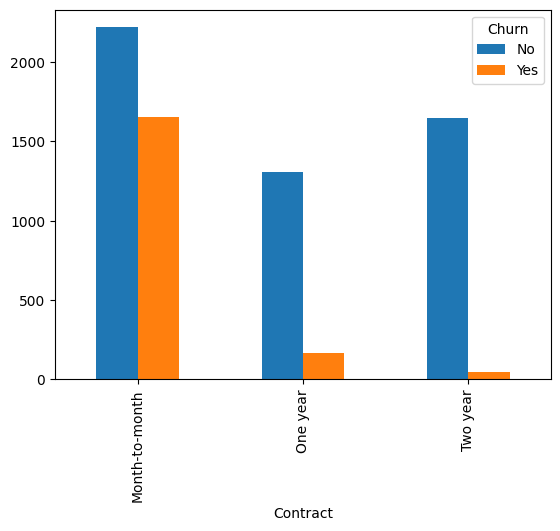
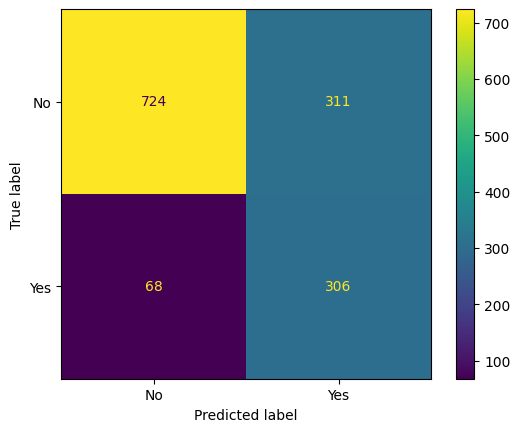
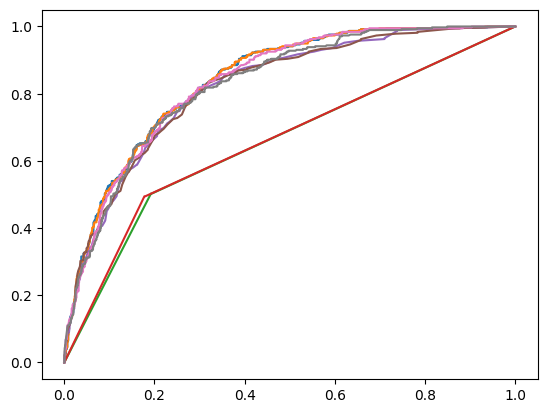
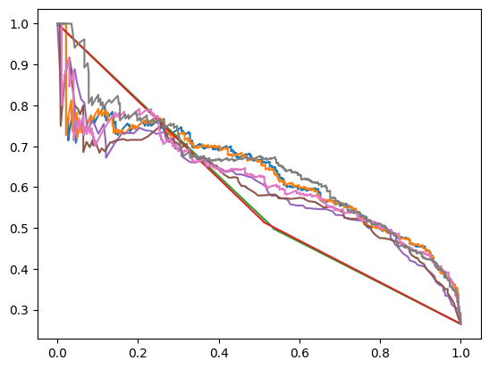
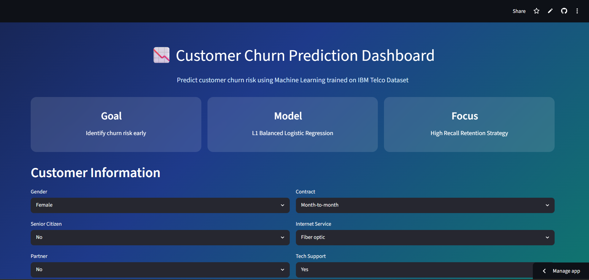
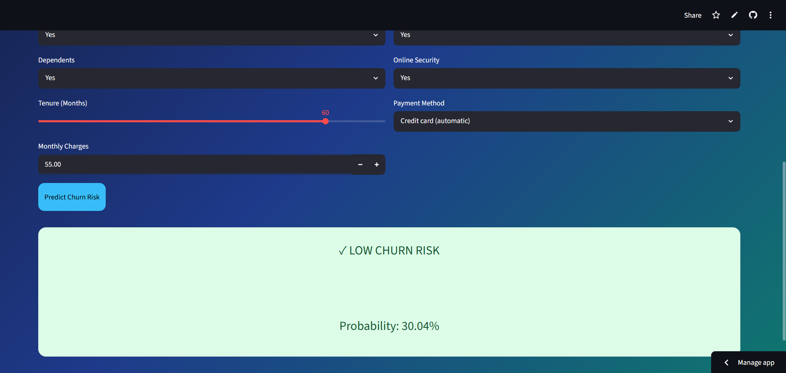

# Customer Churn Prediction using Machine Learning

## Results Summary

- **Best Model:** L1 Regularized Class-Weighted Logistic Regression
- **Best Recall Score:** 0.818 (Churn Class)
- **Best Selected Model ROC AUC Score:** 0.836
- **Cross Validation:** Stratified 5-Fold Cross Validation
- **Deployment:** Streamlit Web Application
- **Primary Focus:** Classification, Imbalanced Learning, Feature Engineering, Recall Optimization
- **Live App:** [Open Streamlit App](https://telco-churn-prediction-eeux5fv75ddwt4hqklgrem.streamlit.app/)

---

# Project Overview

This project focuses on predicting customer churn for a telecom company using Machine Learning.

The primary objective was not only maximizing predictive performance but building a business-oriented solution that prioritizes:

- Detecting customers likely to churn
- Maximizing recall for churn customers
- Reducing missed churn cases
- Building interpretable and deployable ML solutions

The project implements a complete end-to-end classification workflow:

- Exploratory Data Analysis (EDA)
- Data Cleaning
- Feature Engineering
- Imbalanced Learning
- Model Training & Comparison
- Threshold Optimization
- Cross Validation
- Hyperparameter Tuning
- Model Interpretation
- Streamlit Deployment

---

# Dataset Information

**Dataset Source:**

[Kaggle IBM Telco Customer Churn Dataset](https://www.kaggle.com/datasets/blastchar/telco-customer-churn)

Dataset Characteristics:

- Total Customers: **7043**
- Problem Type: **Binary Classification**
- Target Variable: **Churn (Yes / No)**
- Class Imbalance: Present

Features Include:

- Customer Demographics
- Subscription Information
- Billing Information
- Service Usage
- Account Details

---

# Exploratory Data Analysis (EDA)

EDA was performed to understand customer behavior patterns and identify factors influencing churn.

## Key Findings

- Month-to-month customers showed significantly higher churn
- Customers with shorter tenure were more likely to churn
- Fiber optic customers showed elevated churn rates
- Lack of support services increased churn risk
- Higher monthly charges increased churn probability
- Electronic check users showed higher churn behavior

---

The target variable showed class imbalance, which motivated the use of:

- Class weighting
- Recall optimization
- Threshold tuning
- Stratified cross validation

---

## Contract Type vs Churn



Month-to-month contracts showed substantially higher churn compared to yearly contracts.

---

## Tenure Distribution vs Churn


Customers with lower tenure exhibited significantly higher churn behavior.

---

# Data Preprocessing

Preprocessing Steps:

- Removed customerID column
- Converted TotalCharges into numeric format
- Handled missing values
- One-Hot Encoding for categorical variables
- Stratified Train-Test Split
- Feature Scaling using StandardScaler

Train-Test Split:

- Training Data: 80%
- Testing Data: 20%

---

# Feature Engineering

Additional features were created to better capture customer lifecycle patterns.

Features Created:

### Tenure Buckets

Customers categorized into:

- New
- Moderate
- Long-Term

### Service Usage Score

Aggregated service utilization into a single variable.

### High Charge New Customer Flag

Identifies customers with:

- High monthly charges
- Low tenure

These engineered features improved customer behavior representation.

---

# Models Implemented

## Logistic Regression

Baseline linear classification model.

### Observations

- Strong baseline performance
- Good generalization
- Lower recall

---

## Balanced Logistic Regression

Applied class weighting to improve minority detection.

### Observations

- Recall improved substantially
- Precision reduced moderately

---

## Decision Tree

Used for capturing nonlinear relationships.

### Observations

- Severe overfitting observed
- Poor generalization

---

## Random Forest

Used ensemble learning for improved stability.

### Observations

- Better generalization
- Recall remained limited

---

## Final Model: L1 Regularized Balanced Logistic Regression

Reasons for selection:

- Highest recall among stable models
- Strong ROC AUC maintained
- Better precision-recall tradeoff
- Lower overfitting risk
- Sparse coefficients improve interpretability

---

# Model Performance Summary

| Model | Accuracy | Precision | Recall | ROC AUC |
|------|------|------|------|------|
| Logistic Regression | 0.799 | 0.648 | 0.532 | 0.841 |
| Balanced Logistic Regression | 0.735 | 0.500 | 0.786 | 0.841 |
| Decision Tree | 0.727 | 0.486 | 0.503 | 0.655 |
| Random Forest | 0.782 | 0.614 | 0.484 | 0.820 |
| **L1 Balanced Logistic Regression** | **0.731** | **0.496** | **0.818** | **0.836** |

---

# Model Evaluation

## Confusion Matrix (Final Model)



The model successfully captured most churn customers while maintaining manageable false positives.

---

## ROC Curve Comparison



Observations:

- Logistic models consistently showed stronger separation capability
- Tree models produced weaker discrimination
- L1 Balanced Logistic Regression maintained strong ranking performance

---

## Precision Recall Curve



Observations:

- Recall optimization improved churn detection significantly
- L1 Balanced Logistic Regression achieved stronger tradeoff than constrained Random Forest

---

# Feature Importance / Coefficient Analysis

Most influential churn factors:

- Fiber Optic Internet
- Electronic Check Payment
- High Monthly Charges
- Contract Type
- Customer Tenure
- Tech Support Availability

L1 Regularization additionally removed weak features automatically.

---

# Cross Validation

Validation Strategy:

- Stratified 5 Fold Cross Validation

Purpose:

- Reduce randomness from single split evaluation
- Measure stability
- Estimate realistic generalization performance

Cross validation confirmed that selected models remained stable across folds.

---

# Threshold Optimization

Threshold tuning was performed because:

- Default threshold may not maximize recall
- Churn prediction prioritizes customer capture

Final Selected Threshold:

**0.55**

Tradeoff:

- Lower Threshold → Higher Recall
- Higher Threshold → Better Precision

---

# Streamlit Deployment

A Streamlit application was developed for interactive churn prediction.

Users can:

- Input customer information
- Generate churn predictions
- View churn probability
- Experiment with different customer profiles

---

## Streamlit Application UI



---

## Example Prediction



---

# Technologies Used

- Python
- Pandas
- NumPy
- Matplotlib
- Seaborn
- Scikit-Learn
- Streamlit
- Joblib

---

# Project Structure

## Project Structure

```text
telco-churn-prediction/
│
├── app.py
├── README.md
├── requirements.txt
├── model.pkl
├── scaler.pkl
├── columns.pkl
│
├── images/
│   ├── contract_vs_churn.png
│   ├── tenure_boxplot.png
│   ├── confusion_matrix.png
│   ├── roc_curve_comparison.png
│   ├── precision_recall_curve.png
│   ├── feature_importance.png
│   ├── streamlit_ui.png
│   └── prediction_example.png
│
└── notebooks/
    └── churn_prediction.ipynb
```

---

# Key Learnings

- Handling imbalanced datasets
- Importance of recall optimization
- Feature engineering for customer analytics
- Cross validation for reliable evaluation
- Threshold tuning for business objectives
- Model interpretation using coefficients
- End-to-end ML deployment

---

# Future Improvements

- Implement sklearn Pipelines
- Add SHAP Explainability
- Experiment with Gradient Boosting Models
- Automated Hyperparameter Optimization
- Improve deployment robustness

---

# Conclusion

This project demonstrates a complete Machine Learning pipeline for customer churn prediction.

## Final Outcome

- Recall improved from **53% → 82%**
- Built business-focused classification system
- Maintained competitive ROC AUC
- Created interpretable deployment-ready model

The final model prioritized identifying churn customers rather than maximizing raw accuracy, making it more aligned with real-world retention objectives.

---

# Author

Machine Learning project focused on classification, business impact, and deployment.
